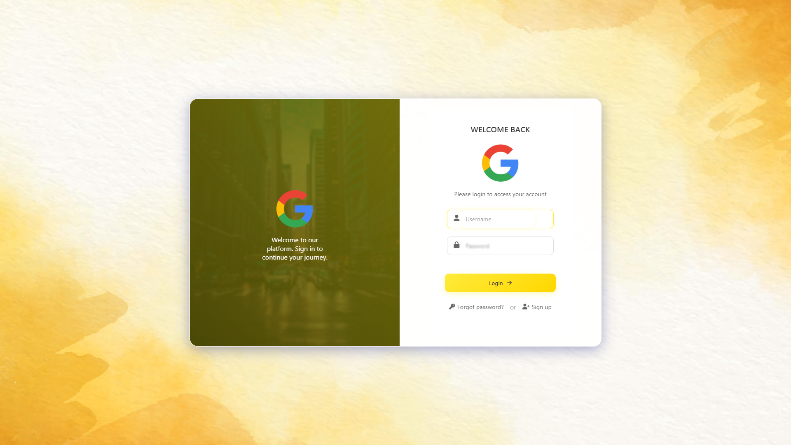

<div align="center">

# 🌟 Modern Classic Glass Morphism Login Form

**A stunning, responsive login form with a blend of modern and classic design elements, featuring glass morphism, smooth animations, and responsive design.**



</div>

---

## ✨ Features
- 🌌 **Modern Classic** glass morphism design  
- 📱 Fully **responsive layout**  
- 🎞️ Smooth **animations and transitions**  
- ✅ Form **validation**  
- 🎨 Interactive **hover effects**  
- 🌐 **Cross-browser** compatibility  
- 📲 **Mobile-first approach**  
- ♿ **Accessible design**

---

## 🛠️ Technologies
- 🖋️ **HTML5**
- 🎨 **CSS3**
- 🌟 **Font Awesome Icons**
- ✍️ **Google Fonts**

---

## 🚀 Getting Started

### Prerequisites
- 🌐 A modern web browser  
- 🖥️ Basic understanding of HTML and CSS  

### Installation
1. **Clone the repository**
   ```bash
   git clone https://github.com/Code1616/modern-classic-login-form.git
   ```

2. **Navigate to the project directory**
   ```bash
   cd modern-classic-login-form
   ```

3. **Open the file**
   Open `index.html` in your browser or use a live server for best results.

---

## 💻 Usage

### Customization
To personalize the design:  
1. **Modify CSS variables in `:root` for colors**  
   ```css
   :root {
       --primary-color: #ffeb3b;
       --secondary-color: #ffd700;
       --text-dark: #333;
       --text-light: #666;
       --white: #fff;
       --glass-bg: rgba(255, 255, 255, 0.95);
   }
   ```

2. **Replace images in the `image` folder**:  
   - `logo.png` - Your company logo  
   - `city2.jpg` - Background image  
   - `i.jpg` - Main background  

---

## 📱 Responsive Design
- 🖥️ **Desktop**: Full layout with side image  
- 📊 **Tablet**: Adaptable grid layout  
- 📱 **Mobile**: Stacked layout for improved usability  

---

## ✅ Browser Support
- 🌐 Chrome (latest)  
- 🦊 Firefox (latest)  
- 🍎 Safari (latest)  
- 🖥️ Edge (latest)  

---

## 🎯 Live Demo
🌟 **[View Live Demo](https://code1616.github.io/modern-classic-login-form/)**  

---

## 📝 License
📄 This project is licensed under the **MIT License**. See the `LICENSE` file for details.

---

## 🤝 Contributing

1. **Fork the Project**  
2. **Create your Feature Branch**  
   ```bash
   git checkout -b feature/AmazingFeature
   ```
3. **Commit your Changes**  
   ```bash
   git commit -m 'Add some AmazingFeature'
   ```
4. **Push to the Branch**  
   ```bash
   git push origin feature/AmazingFeature
   ```
5. **Open a Pull Request**

---

## 👤 Author
**Roozbeh**  
- GitHub: [@Code1616](https://github.com/Code1616)

---

## 🌟 Show Your Support
💖 **Give this project a ⭐ if it helped you or inspired you!**

---

<div align="center">
  
_Made with ❤️ by [Roozbeh]_

</div>